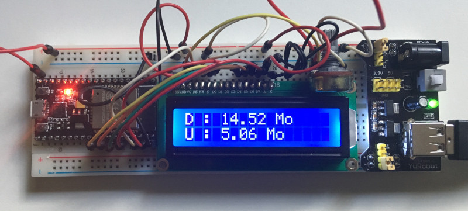

# boxmeter

Micro-controller program to display bandwdith usage of a Huawei e5186s-22a 4G box on a screen instead of having to go to the admin page

On hardware side, it is made of an ESP32S, which integrates a Wifi controller and enough ram to handle http requests and answers. Pinout available here :

https://docs.zerynth.com/latest/official/board.zerynth.nodemcu_esp32/docs/index.html

For the display, a 1602a screen is used. This is a good looking screen, but the wiring is a bit complicated, and it requires a potentiometer to control the contrast. Here is some help to wire the screen with the ESP32 :

https://www.instructables.com/id/ESP32-How-to-Interface-LCD-With-ESP32-Microcontrol/

On software side, the program is written using the Arduino environment. The project works with VSCode and the PlatformIO plugin to allow easy compilation and handle library dependencies.

Things are pretty simple, the only difficulty is that we need to request a token to the webserver and pass it as a cookie to be able to use the API of the webserver running on the box.
